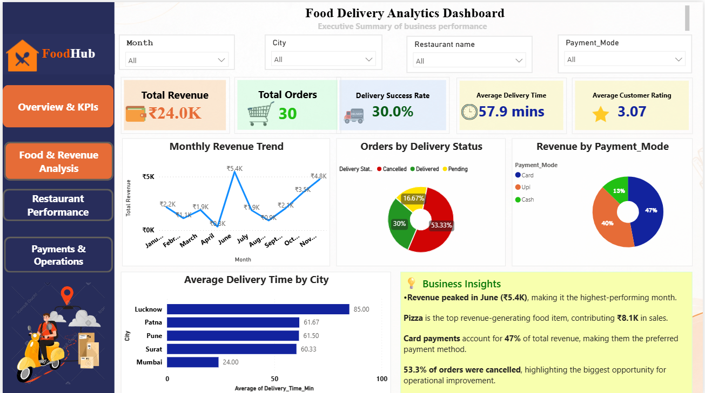
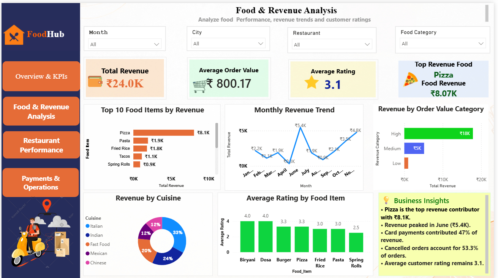
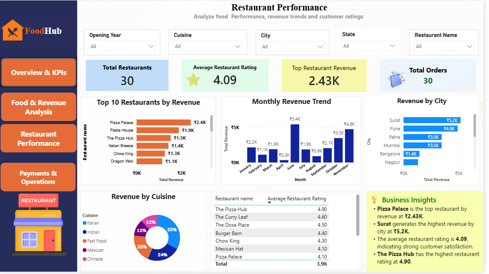
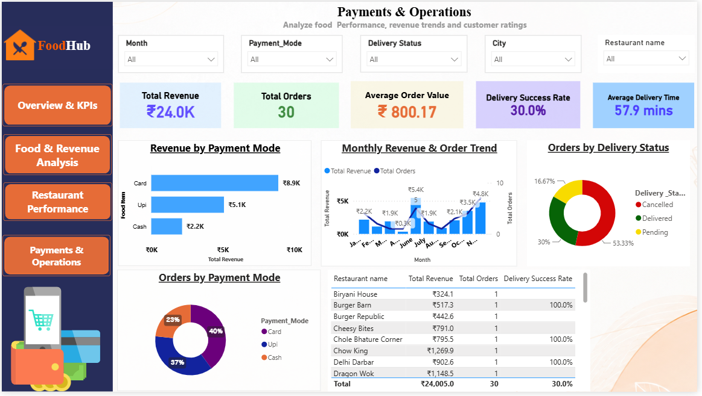

# 🍔 Food Delivery Analytics | Power BI

A Data Analytics project created using Power BI to analyze food delivery data across revenue, orders, food items, restaurants, payments, ratings, and delivery performance.

## 📊 Dashboard Preview

### Overview & KPIs

### Food & Revenue Analysis

### Restaurant Performance

### Payments & Operations

## 🎯 Objective

To analyze food delivery data and create an interactive Power BI dashboard that shows business performance and highlights areas that need attention.

## 🛠️ Tools Used

- Power BI
- Power Query
- DAX
- Data Modeling

## 🔄 What I Did

- Understood the business requirements
- Prepared and cleaned the data using Power Query
- Built the data model in Power BI
- Created DAX measures for key KPIs
- Designed a 4-page interactive dashboard
- Analyzed revenue, orders, food items, restaurants, payments, ratings, and delivery performance
- Created insights and recommendations based on the analysis

## 📈 Key KPIs

- Total Revenue
- Total Orders
- Average Order Value
- Delivery Success Rate
- Average Delivery Time
- Average Customer Rating

## 🔍 Key Insights

- Total Revenue: **₹24.0K**
- Total Orders: **30**
- Average Order Value: **₹800.17**
- Delivery Success Rate: **30.0%**
- Average Delivery Time: **57.9 minutes**
- **Pizza** generated the highest food revenue at approximately **₹8.1K**
- **June** had the highest monthly revenue at approximately **₹5.4K**
- **Card** payments contributed **47% of revenue**
- **53.3% of orders were cancelled**, showing an important area for operational improvement

## 📂 Project Files

- `Food Delivery Analytics Dashboard.pbix` — Power BI dashboard
- `FoodDelivery_Business_Requirements.pptx` — Business requirements
- `Order_detail.csv` — Order data
- `Restaurants_Details.csv` — Restaurant data

## 👤 About

**Mansi Shirsat**

Aspiring Data Analyst

**Project Focus:** Power BI | Data Analysis
